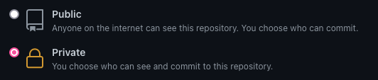

# Test d'évaluation Frontend Pickbeam

## Présentation

Ce dépôt contient les instructions pour le test technique frontend de Pickbeam.

Son objectif est de nous donner un aperçu de tes connaissances techniques pratiques à travers la réalisation d'un site internet.

## Objectif

L'objectif est de développer la première page du site Pickbeam [https://pickbeam.com/](https://pickbeam.com/)

Pour cela tu peux utiliser la technologie Front et les librairies que tu souhaites et au besoin utiliser un CMS Headless pour gérer le contenu. La seule contrainte est d'utiliser l'architecture Jamstack pour le développement du site.

Enfin, il y a quelques questions à répondre dans le document [SOLUTION.md](SOLUTION.md).

## Démarrage du test

Ce dépôt étant un template, il est possible de créer un nouveau projet en utilisant celui-ci comme [template](https://github.com/pickbeam-webmarketing/test-pickbeam-front/generate). Voir le gros bouton vert avec écrit `Template` dessus. Merci de laisser le projet généré en privé.

Alternativement, cloner ce dépôt.

    git clone git@github.com:pickbeam-webmarketing/test-pickbeam-front.git

## Restitution

Lorsque tu auras terminé, partages nous le repository git que tu auras créé

## Durée de réalisation

La durée de réalisation est de 1 semaine, tu peux nous faire parvenir le résultat avant s'il te paraît satisfaisant.
